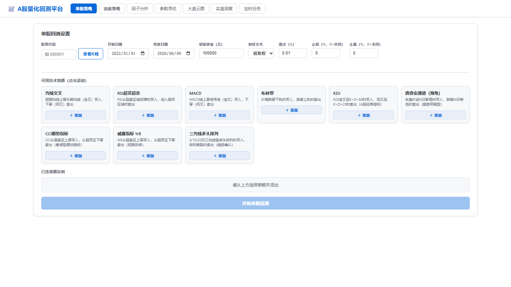
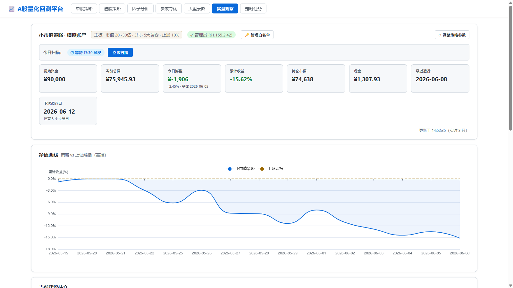
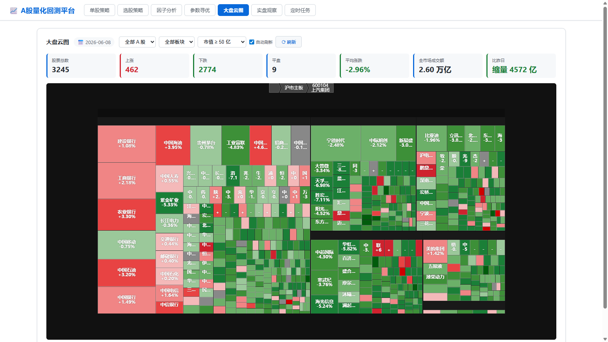
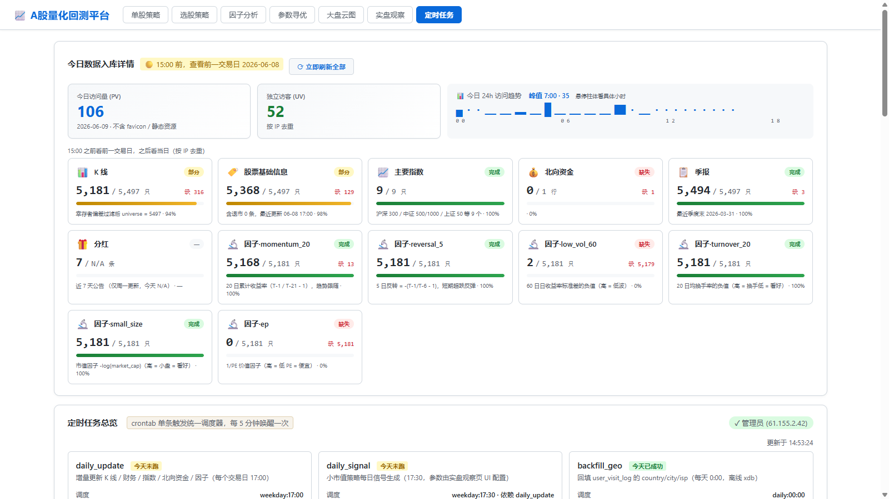
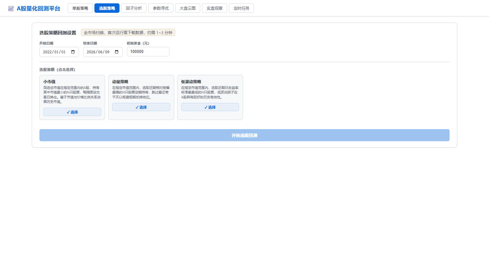

# A 股量化回测平台

基于 FastAPI + ECharts 的 A 股量化策略回测与模拟交易平台。覆盖**单股信号**、**组合选股**、**模拟盘**、**走查优化**、**大盘云图**、**LLM 股票分析**六类场景。



---

## 目录

- [核心特性](#核心特性)
- [快速开始](#快速开始)
- [内置策略](#内置策略)
- [使用入口](#使用入口)
- [添加自定义策略](#添加自定义策略)
- [回测机制](#回测机制)
- [数据架构](#数据架构)
- [调度任务](#调度任务)
- [生产部署](#生产部署)
- [项目结构](#项目结构)
- [二次开发指南](#二次开发指南)
- [实盘接入](#实盘接入)
- [免责声明](#免责声明)

---

## 核心特性

**回测引擎**
- 单股策略:11 种内置技术指标(MA/RSI/MACD/KDJ/Bollinger/CCI/Williams/Donchian/三均线/动量/低波动)
- 组合策略:全市场选股 + 定期调仓,基于真实历史市值
- 资金算账全程 `Decimal` 高精度(避免长跑回测累积浮点误差)
- 末次平仓写入 trades,win_rate 准确

**模拟盘(Paper Trading)**
- 收盘后自动跑策略 → 落库 → 前端展示持仓/累计收益/成交流水
- 持仓自动除权:接 akshare 分红送转事件,持仓 shares/buy_price 跟 stock_kline qfq 同口径
- 跌停股留存:调仓日跌停卖不掉的旧仓自动留存,新仓数缩减保等权
- 止损基于累积 pct_change(避开分红除权误触发)
- 整段调仓事务化:中途失败自动回滚,持仓与现金不会割裂

**Walk-Forward 优化**
- 按交易日整数切窗(非自然日,避免跨春节/国庆漂移)
- 自动报告 IS/OOS 衰减率与参数稳定性
- 参数组合数 > 100 自动告警过拟合风险

**大盘云图**
- ECharts treemap,按行业 / 板块聚类
- 60s 进程缓存,数据来源 stock_kline 表

**LLM 股票分析**
- 接入 [elsejj/mcp-cn-a-stock](https://github.com/elsejj/mcp-cn-a-stock) 公开 MCP 服务
- `GET /api/llm_assistant/analyze?symbol=600000&level=brief|medium|full`
- 返回 markdown 报告(基本面 + 行情 + 财务 + 技术)

**安全**
- IP 白名单写操作隔离(`paper_admin_ip` 表)
- `TRUSTED_PROXIES` 环境变量配可信反代,防 `X-Forwarded-For` 伪造

---

## 快速开始

### 环境要求

- Python 3.10+
- MySQL 5.7+ / 8.x

### 安装

```bash
git clone https://github.com/Lee123577/backtest_platform.git
cd backtest_platform
pip install -r requirements.txt
```

### 配置数据库

复制 `.env.example`(没有就建一份)填入:

```env
MYSQL_HOST=127.0.0.1
MYSQL_PORT=3306
MYSQL_USER=root
MYSQL_PASSWORD=your_password
MYSQL_DATABASE=back_test
```

可选环境变量:

| 变量 | 默认 | 说明 |
|---|---|---|
| `DB_MAX_CONNECTIONS` | 20 | 连接池上限 |
| `DB_BORROW_TIMEOUT` | 30 | 借连接超时(秒) |
| `TRUSTED_PROXIES` | (空) | 可信反代 IP/CIDR,逗号分隔。空 = 一律忽略代理头 |
| `PAPER_ADMIN_INITIAL_IPS` | (空) | 启动时往白名单写入的 IP(避免首次锁死) |
| `MCP_CNSTOCK_URL` | `http://82.156.17.205/cnstock/mcp` | LLM 分析远程 MCP 地址 |

### 初始化历史数据

首次跑需要全量导入(2010 ~ 今,约 4-6 小时):

```bash
python scripts/import_history.py             # 全套
python scripts/import_history.py --step kline    # 只导 K 线
python scripts/import_history.py --step index    # 只导指数
python scripts/import_history.py --step finance  # 只导财务
```

### 启动

```bash
python run.py
# 访问 http://127.0.0.1:8000
```

---

## 内置策略

### 单股信号策略(`/api/backtest`)

| ID | 名称 | 核心逻辑 |
|---|---|---|
| `ma_cross` | 双均线 | 短期均线上穿/下穿长期均线 |
| `triple_ma` | 三均线 | 短/中/长三均线趋势确认 |
| `rsi` | RSI | 超卖买入、超买卖出 |
| `macd` | MACD | DIF 与 DEA 金叉/死叉 |
| `bollinger` | 布林带 | 价格触及下轨买入、上轨卖出 |
| `kdj` | KDJ | K、D 线金叉/死叉 |
| `cci` | CCI | 顺势指标,±100 突破 |
| `williams` | 威廉指标 | %R 超买超卖 |
| `donchian` | 唐奇安通道 | 价格突破 N 日高/低点 |

### 组合选股策略(`/api/portfolio_backtest`)

| ID | 名称 | 核心逻辑 |
|---|---|---|
| `small_cap` | 小市值 | 市值 [cap_min, cap_max] 区间内最小的 N 只,定期换仓 |
| `momentum` | 动量 | 过去 N 日涨幅最大(可跳过最近 K 日避免反转) |
| `low_vol` | 低波动 | 过去 N 日日收益率标准差最小的 N 只 |

所有策略支持参数调整(前端 UI 编辑器),范围由各策略 `param_schema` 声明。

---

## 使用入口

| 路径 | 用途 |
|---|---|
| `/` | 单股回测页 |
| `/portfolio` | 组合回测页(SSE 进度流) |
| `/paper_trading` | 模拟盘:持仓/收益曲线/成交流水/参数编辑 |
| `/factors` | 因子分析(IC 计算、分组收益) |
| `/walk_forward` | 走查优化:IS/OOS 窗口结果 + 参数稳定性 |
| `/cloudmap` | 大盘云图 treemap |
| `/tasks` | 调度任务监控:历史运行/状态/手动触发 |
| `/api/llm_assistant/analyze?symbol=600000` | LLM 股票分析(markdown 报告) |

### 功能截图

模拟盘(`/paper_trading`)— 持仓 / 累计收益曲线 / 调仓日预告:



大盘云图(`/cloudmap`)— ECharts treemap,按行业 + 涨跌幅着色:



任务监控(`/tasks`)— 数据完整性概览 + 调度任务状态:



组合选股(`/portfolio`)— 三种内置组合策略,SSE 实时进度:



---

## 添加自定义策略

### 单股策略

新建 `app/strategies/my_strategy.py`:

```python
from .base import BaseStrategy
import pandas as pd

class MyStrategy(BaseStrategy):
    name = "我的策略"
    param_schema = {
        "window": {"default": 10, "min": 2, "max": 100,
                   "description": "窗口期", "type": "int"},
    }

    def generate_signals(self, df: pd.DataFrame) -> pd.Series:
        # 返回 Series:1=买入, -1=卖出, 0=持有
        # 信号在第 T 日产生,第 T+1 日开盘执行(无未来数据)
        ...
```

注册到 `app/strategies/registry.py`:

```python
from .my_strategy import MyStrategy
STRATEGY_REGISTRY["my"] = MyStrategy
```

### 组合策略

新建 `app/strategies/my_portfolio.py`:

```python
from .portfolio_base import PortfolioBaseStrategy
from typing import Any, Dict, List
import pandas as pd

class MyPortfolioStrategy(PortfolioBaseStrategy):
    name = "我的组合"
    param_schema = {
        "hold_days": {"default": 5, "min": 1, "max": 60,
                      "description": "持仓天数", "type": "int"},
    }

    def select_stocks(
        self, date: Any,
        close_lookup: Dict[str, float],       # 昨日收盘价(无未来数据)
        ref_data: pd.DataFrame,               # 当日 universe(已注入历史真实市值)
        rolling_prices: Dict[str, List[float]] # 每只股票的历史 close 序列
    ) -> List[str]:
        # 返回本期持仓的股票代码列表
        ...
```

注册到 `app/strategies/registry.py`:

```python
from .my_portfolio import MyPortfolioStrategy
PORTFOLIO_REGISTRY["my_portfolio"] = MyPortfolioStrategy
```

---

## 回测机制

### 交易成本

| 项 | 默认值 | 说明 |
|---|---|---|
| 佣金 | 万分之三 | 双边收取,最低 5 元 |
| 印花税 | 千分之一 | 仅卖出收取 |
| 滑点 | 万分之一 | 价格 ± 滑点系数 |

### 撮合规则

- A 股标准 100 股/手,不足一手不成交
- 信号在 T 日产生,T+1 日开盘价 ± 滑点执行(**无未来数据**)
- 调仓日先全卖后全买,等权分配剩余资金
- 跌停卖不掉的旧仓**留存**,新仓数自动缩减保持总仓位 ≈ N 只等权
- 末次强平计入 trades(`win_rate` / `trade_count` 不漏)

### 止损 / 止盈

- 单股:基于 `entry_price` 和当日 close 比较
- 模拟盘:基于 stock_kline `pct_change` 累乘(避开 qfq 复权基准调整时的误触发)

### 基准

- 单股模式:买入持有同一标的
- 组合模式:中证 500(`000905`)

### 算钱精度

所有 capital / cost / commission / cash 累加用 `Decimal` 而非 `float`,避免几千笔交易后累积出几分钱漂移。代码见 [`app/engine/money.py`](app/engine/money.py)。

---

## 数据架构

### 数据流

```
[cron 5 min]
   ↓
scripts/run_scheduled_tasks.py
   ↓
scheduler.runner.run_due()  →  subprocess 跑各任务
   ├─ daily_update          weekday 17:00  增量 K 线 / 财务 / 指数 / 北向 / 因子
   ├─ daily_signal          weekday 17:30  依赖 daily_update,跑小市值选股
   ├─ backfill_geo          daily 00:00    回填访问日志 IP 地理位置
   └─ backfill_dividend_full daily 02:00   每月 1 号全市场 ex_div 回填(自查日期)
        ↓
   paper_trading.runner.run_once()  (除权调整 → 止损 → 候选池 → 调仓 → 落库)
        ↓
   MySQL: paper_account / paper_holdings / paper_signal_run /
          paper_signal_position / paper_equity_daily
        ↓
   FastAPI 读取并对外展示
```

### 数据源降级链

**K 线 / 指数 / 全市场** 三类查询都遵循"DB 优先 → 外部 API 兜底"两层结构,**无文件缓存中间态**。

#### K 线(`app/data/data_loader.py:get_kline_data`)

```
1. stock_kline 表(qfq,自 2010 起)
2. akshare AkshareDataFeed:eastmoney(无代理/系统代理)→ sina → 腾讯,共 6 路径
```

#### 指数(`app/data/market_data.py:get_index_history`)

```
1. index_daily 表
2. akshare 六路径降级:
   A. _call_no_proxy(index_zh_a_hist)        eastmoney push2
   B. index_zh_a_hist                        (系统代理)
   C. _call_no_proxy(stock_zh_index_daily_em) eastmoney push2his + sh/sz
   D. stock_zh_index_daily_em                (系统代理)
   E. _call_no_proxy(stock_zh_index_daily)   sina + sh/sz
   F. stock_zh_index_daily                   (系统代理)
```

云服务器 eastmoney push 端点常被拦截,**sina 是稳定兜底**。

#### 全市场快照(`app/data/market_data.py:get_universe_snapshot`)

```
1. stock_kline 最近一个含 market_cap 的交易日(≥ 500 只)
2. market_universe_snapshot 表(持久化快照,离线兜底)
3. data.eastmoney.com xuangu 选股器(线上主力,ps=500 分页拉 5500+ 只)
4. akshare stock_zh_a_spot_em(无代理)
5. akshare stock_zh_a_spot_em(系统代理)
6. curl_cffi Chrome TLS 模拟(Windows 易 crash,subprocess 隔离)
```

每次成功获取自动写回 `market_universe_snapshot`,确保下次离线可用。

### 数据库表清单

| 表 | 维护方 | 用途 |
|---|---|---|
| `stock_info` | import_history / daily_update | 股票基础信息(名称、上市/退市日、ST 状态、板块) |
| `stock_kline` | import_history / daily_update | 日 K(qfq)+ 估值(市值/PE/PB)+ 质量标记 |
| `stock_finance` | import_history / daily_update | 季报核心财务指标 |
| `stock_dividend` | import_history / backfill_dividend / daily_update | 除权除息事件(`ex_date` PK) |
| `index_daily` | import_history / daily_update | 主要指数日线 |
| `index_constituent` | import_history / daily_update | 指数成分股(月度刷新) |
| `north_fund_flow` | daily_update | 北向资金净流入 |
| `factor_value` | daily_update | 因子值(动量/反转/低波动/换手/规模/价值) |
| `market_universe_snapshot` | market_data 自动 | 全市场快照备份 |
| `paper_account` | paper_trading | 模拟账户单行状态 |
| `paper_holdings` | paper_trading | 当前持仓(带 `last_dividend_check_date`) |
| `paper_signal_run` | paper_trading | 每日运行记录 |
| `paper_signal_position` | paper_trading | 每次运行的持仓快照 |
| `paper_equity_daily` | paper_trading | 每日净值 + 基准 |
| `paper_admin_ip` | admin_ip API | 写操作 IP 白名单 |
| `task_run_log` | scheduler | 定时任务运行日志 |
| `user_visit_log` | visit_log middleware | API 访问日志(地理位置) |

---

## 调度任务

`app/scheduler/registry.py` 配置,`scripts/run_scheduled_tasks.py` cron 入口(5 分钟唤醒一次):

| 任务名 | 调度 | 依赖 | 说明 |
|---|---|---|---|
| `daily_update` | weekday 17:00 | — | 全量增量更新 |
| `daily_signal` | weekday 17:30 | `daily_update` | 模拟盘选股 |
| `backfill_geo` | daily 00:00 | — | 访问日志 IP 地理回填 |
| `backfill_dividend_full` | daily 02:00 | — | 月初 1 号跑全市场 ex_div 回填(脚本内自查日期) |

任务运行记录写入 `task_run_log`,前端 `/tasks` 可视化。**幂等保护**:同一任务当天已 `success` 则跳过;同名任务在 running 中也跳过(避免长任务被中途撞上)。

---

## 生产部署

### systemd

`scripts/backtest.service` 已配置好,安装:

```bash
sudo cp scripts/backtest.service /etc/systemd/system/
sudo systemctl daemon-reload
sudo systemctl enable backtest
sudo systemctl start backtest
```

### cron(注册调度入口)

```bash
crontab -e
# 添加:
*/5 * * * * cd /path/to/backtest_platform && python3 scripts/run_scheduled_tasks.py >> scripts/scheduler.log 2>&1
```

### 反向代理(可选)

如果走 nginx/Caddy 在 80/443 转发到 8000,**务必配 `TRUSTED_PROXIES`**:

```env
TRUSTED_PROXIES=127.0.0.1,10.0.0.0/8
```

否则 `X-Forwarded-For` 头可被任意客户端伪造,绕过 `paper_admin_ip` 白名单。

### 重启 + 查日志

```bash
systemctl restart backtest
journalctl -u backtest -f
ss -lntp | grep :8000
curl -s http://localhost:8000/api/llm_assistant/health
```

---

## 项目结构

```
app/
  data/                      数据获取层
    feed.py                    DataFeed 抽象 + Akshare 实现(K 线/指数)
    data_loader.py             K 线 DB 查询 + 连接池兼容层
    db_pool.py                 真连接池(maxconnections + 背压 + atexit 清理)
    market_data.py             全市场快照编排 + 指数 DB 优先
    universe_fetcher.py        全市场抓取(xuangu / akshare / cffi)
    universe.py                历史可交易股票集(防幸存者偏差)
    filters.py                 A 股准入(ST / 板块判断)
    calendar.py                交易日历(进程内缓存)
    realtime.py                持仓页实时价(xuangu 单股查询)
    quality.py                 K 线写入前质量校验(异常跳价/停牌恢复识别)
    dividend.py                除权事件查询 + 持仓除权调整算法
  engine/                    回测引擎
    backtest.py                单股策略回测
    portfolio_backtest.py     组合策略回测
    walk_forward.py            Walk-Forward 优化(交易日整数切窗)
    walk_forward_api.py        Walk-Forward FastAPI 路由
    money.py                   Decimal 钱算工具
  strategies/                策略实现(11 个 + base/portfolio_base/registry)
  paper_trading/             模拟盘
    runner.py                  每日运行器(被 daily_signal.py 调用)
    db.py                      paper_* 表 DDL + CRUD
    admin_ip.py                IP 白名单(写操作守门)
  scheduler/                 任务调度
    runner.py                  subprocess 执行 + 日志写入 task_run_log
    registry.py                任务清单
    db.py                      task_run_log CRUD
  cloudmap/                  大盘云图(ECharts treemap)
  factors/                   因子分析(IC 计算、分组收益)
  llm_assistant/             LLM 股票分析(MCP 客户端)
    mcp_client.py              httpx streamable-http JSON-RPC
    api.py                     /api/llm_assistant/analyze + /health
  data_status/               数据完整性状态查询
  live/                      实盘接口抽象(无默认实现)
  visit_log.py               HTTP 访问日志中间件(IP 地理 + UA 解析)
  config.py                  Settings(MySQL 配置)
  main.py                    FastAPI 应用入口

scripts/
  import_history.py          全量历史导入(2010 ~ 今,一次性)
  daily_update.py            每日增量(cron 17:00)
  daily_signal.py            每日信号生成(cron 17:30)
  backfill_dividend.py       Ex-div 事件单股回填(支持 --day-of-month / --holdings-only)
  backfill_kline.py          K 线指定区间补漏
  backfill_visit_log_geo.py  访问日志地理回填
  run_scheduled_tasks.py     cron 入口(5 分钟唤醒)
  backtest.service           systemd unit 模板

run.py                       uvicorn 启动入口
requirements.txt             Python 依赖
```

---

## 二次开发指南

### 数据库连接

| 调用方 | 连接管理 | autocommit | 用途 |
|---|---|---|---|
| FastAPI / paper_trading.db / app 内任何模块 | `app.data.data_loader._get_pool()` (走 `db_pool` 真池) | True | 短查询并发安全 |
| 运维脚本(daily_update / import_history / daily_signal) | 各脚本自己 `pymysql.connect()` | **False**(手动 commit) | 大批量事务写入 |

**为什么两套**:API 端每个请求短事务,autocommit 最简;脚本需要批量 `executemany` + 失败回滚,必须手动 commit。

**新增 API 代码**推荐用新接口:

```python
from app.data.db_pool import get_conn

with get_conn() as conn:
    if conn is None:
        return  # DB 不可用
    with conn.cursor() as cur:
        cur.execute(...)
```

老的 `_get_pool()` 仍可用(兼容层,内部走池)。

### 共享模块

新增数据源/过滤器优先在这些模块加方法,**不要**在调用方就地实现:

- `app/data/calendar.py` — 交易日历(`is_trading_day` / `next_n_trading_days` / `count_trading_days`)
- `app/data/filters.py` — A 股准入(`is_st_name` / `is_allowed_board` / `board_of`)
- `app/data/universe_fetcher.py` — 全市场抓取(5 个独立 fetcher,可单测)
- `app/data/dividend.py` — 除权事件查询 + 持仓除权算法
- `app/data/quality.py` — K 线写入前质量校验
- `app/engine/money.py` — Decimal 钱算工具

### 测试

`requirements.txt` 已有 pytest,目前测试覆盖空缺,贡献欢迎从这些核心入口开始:

- `app/engine/backtest.py` `run_backtest` — 给定合成 OHLCV,assert metrics 精确值
- `app/engine/portfolio_backtest.py` — 3 只股 + 1 个 rebalance,assert 末次平仓计入 trades
- `app/data/quality.py` — 主板 ST 跳 6% 应触发 SUSPECT_JUMP
- `app/engine/walk_forward.py` — assert `is_end - is_start == is_days`(防 calendar days 退步)
- `app/data/db_pool.py` — 上限 + 背压

---

## 实盘接入

`app/live/base.py` 定义了 `LiveAdapter` 抽象。目前**没有可用实现**(原 simnow.py 是 stub 已删)。

接真实 CTP 推荐:

- [vnpy](https://www.vnpy.com) — 包含 CTP/SimNow/OpenCTP 等多个网关
- [openctp-ctp](https://openctp.cn) — 纯 CTP,无框架

继承 `LiveAdapter` 在每个方法里调对应 SDK 即可。

---

## 免责声明

本项目仅供学习和研究使用,**不构成任何投资建议**。历史回测结果不代表未来收益。使用本平台进行任何交易决策的风险由使用者自行承担。
